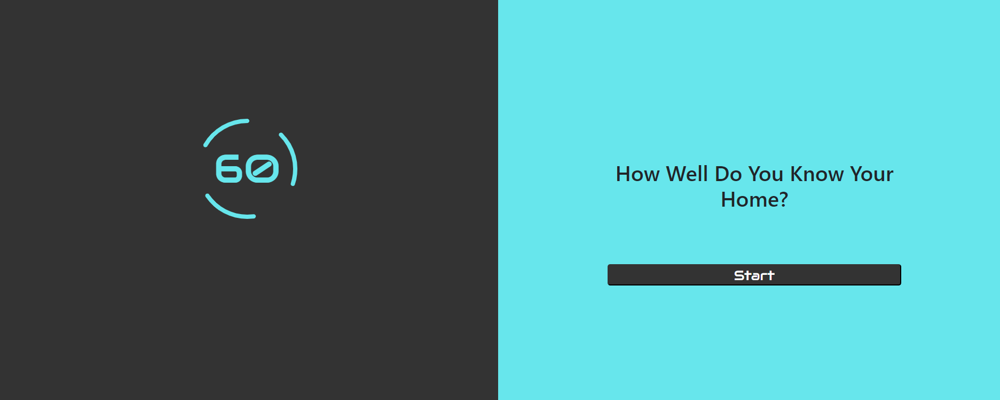
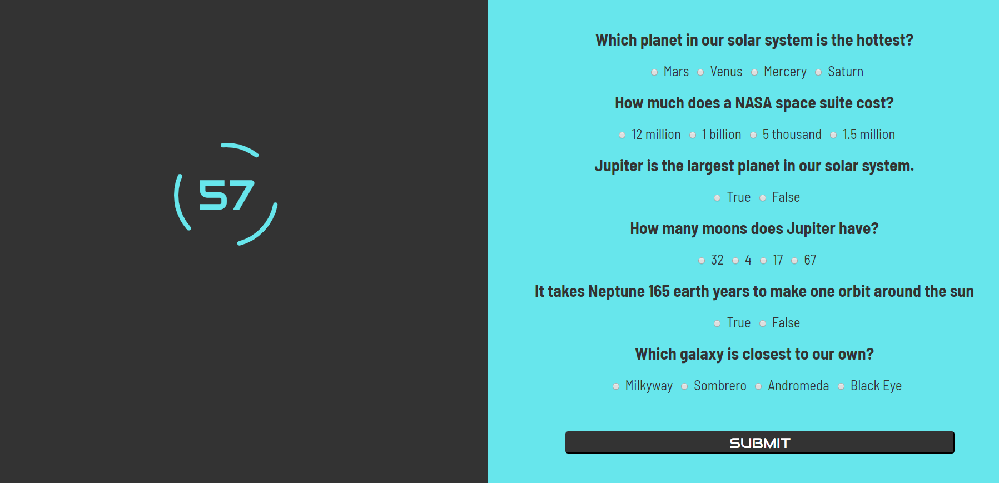

# Trivia-Game

The Trivia game is a timed questionnaire of how much knowlege the player has of their solar system. Once on the start up screen their is a timer on the left that will remain dormant until the "Start" button is pressed. 

Once clicked the game will begin and the time will start a count down

The player has a sixty seconds to guess the answers to the quiz using radio buttons

Once they've answered they can hit the "Submit" button and see their final score.

Tech Used:
Html, Css, Javascript